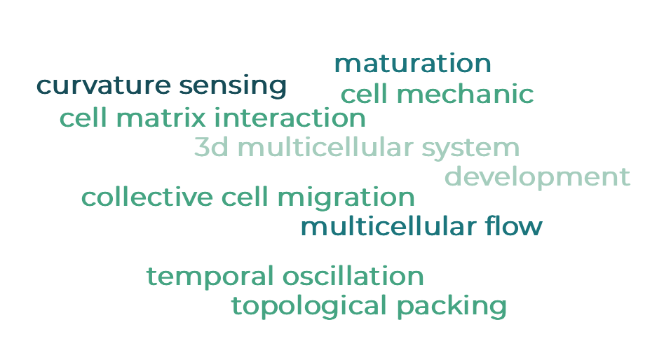
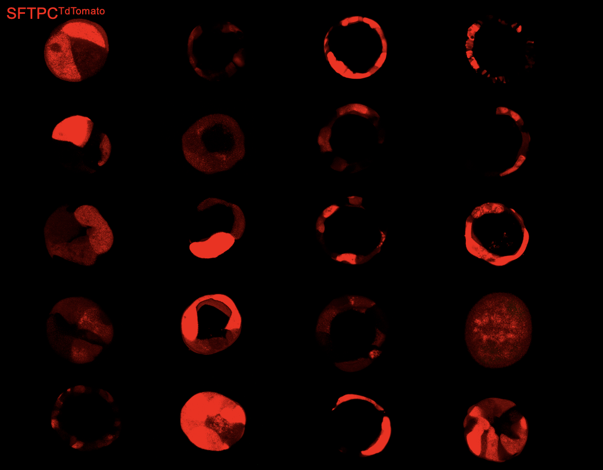

**Here are a summary of the research projects I have been working on**  
 
 
**Some exciting & beautiful stories!**  
 
SFTPC as a maturation marker in human lung alveolospheres (Collaboration with Kotton Lab @BU)   

 
 
Phase seperation using complexed Ginzburg-Landau simulation 

 
 
Multicellular flow field and cell packing in growing alveolospheres 

